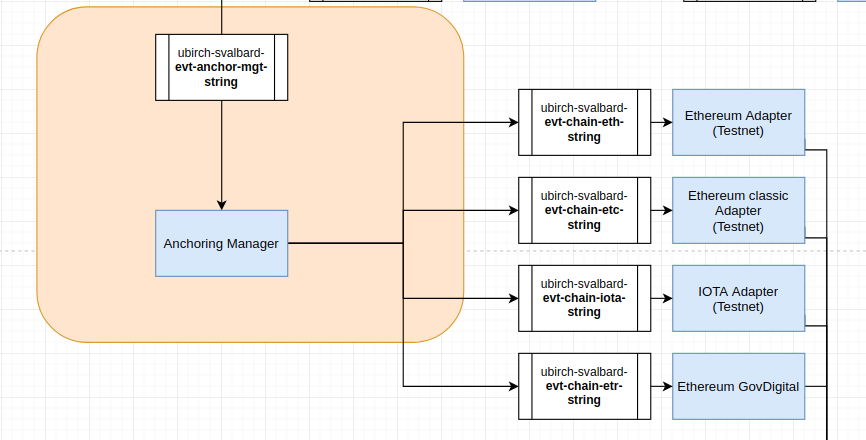
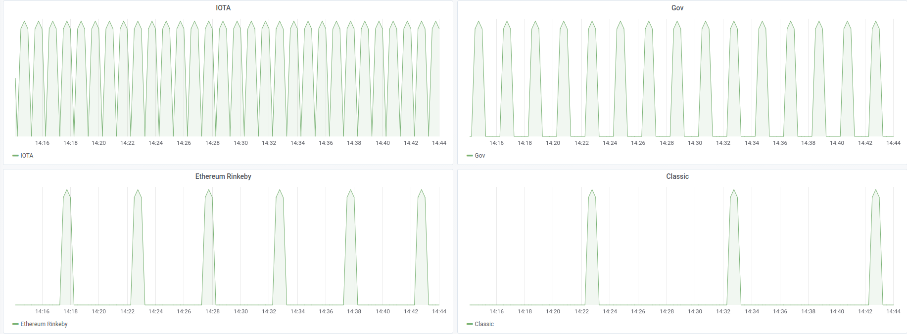

# Ubirch Anchoring Manager



This service handles different anchoring frequencies per targeted blockchain based on the 
global tick provided by the Principal Tree Generator.


## Configuration File

This system is principally configured with a configuration file, similar to the following:

```json
[
  {
    "name": "Iota",
    "period": 1,
    "topic": "iota.topic"
  },
  {
    "name": "Ethereum",
    "period": 3,
    "topic": "etc.topic"
  }
]
```

The anchoring manager expects a list of blockchains, each of which should contain, a name, a period, and a topic name.
The period can't be less than zero. It should be a positive integer.

## Example of the distribution


